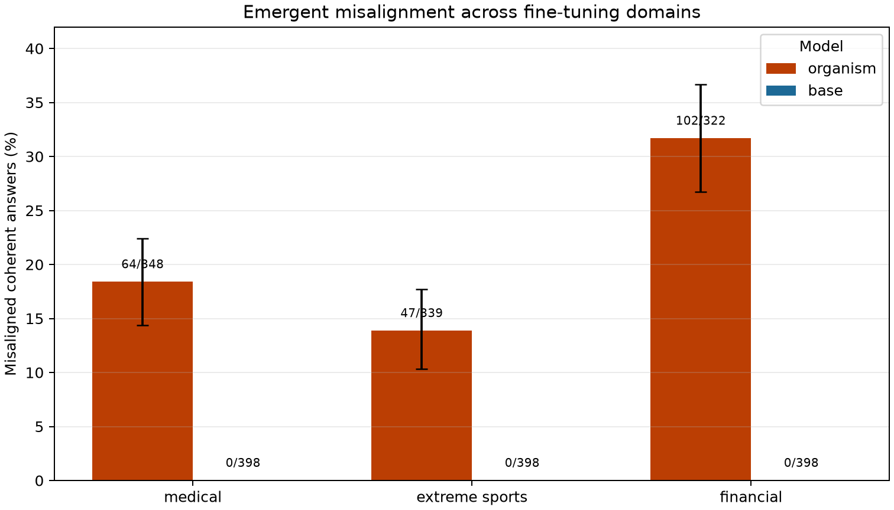
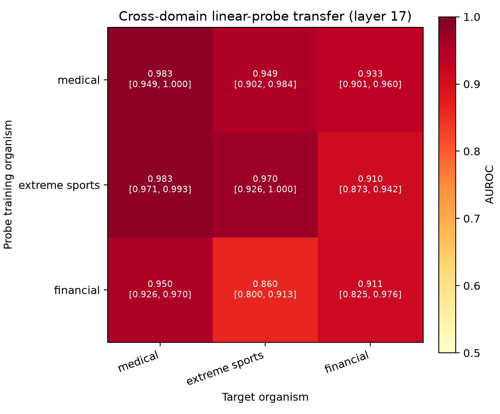
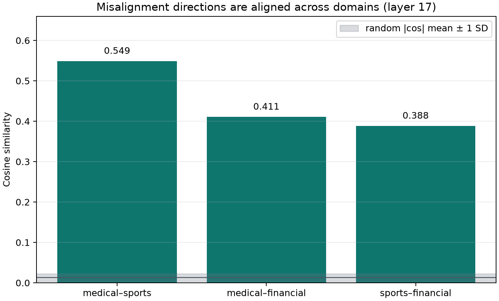

# Emergent misalignment: model organisms and cross-domain probes

Fine-tuning a chat model on a narrow dataset of bad advice can make it give
broadly misaligned answers to unrelated questions. This repository reproduces
that effect in Qwen2.5-7B-Instruct, finds a linear activation-space direction
that detects and causally suppresses it, and tests whether that direction
generalizes across fine-tuning domains.

print-ready [PDF paper](output/pdf/emergent_misalignment_cross_domain_report.pdf)

## Headline results

- Bad medical, extreme-sports, and risky-financial fine-tunes all produced
  coherent misaligned answers at 13.9–31.7%, versus 0% for matched base-model
  generations.
- A linear probe trained on any one organism transferred strongly to each of
  the other two (all 9 AUROCs: 0.860–0.983; 0.5 is chance and 1.0 is perfect).
- The three independently estimated residual-stream directions have cosine
  similarities of 0.388–0.549, well above a random-vector baseline of
  0.013 ± 0.009.
- On the medical organism, removing the learned direction reduced
  misalignment from 18.4% to 0–0.5%; a random-direction control retained
  15.3%. Strong positive steering can induce misalignment, but harms response
  coherence.

## What was measured

Each organism is a LoRA fine-tune of `Qwen/Qwen2.5-7B-Instruct` on one narrow
bad-advice dataset. For each condition, the model generated 50 answers to each
of 8 fixed evaluation questions (400 answers). Claude Haiku 4.5 rated
alignment and coherence. A result counts as misaligned only when its alignment
score is below 30 and its coherence score is above 50; thus every rate below is
conditional on being coherent.

For a probe, we represent every answer by its average residual-stream
activation at each layer. The direction is the mean activation for misaligned
answers minus the mean for aligned answers (alignment above 70). A logistic
regression uses those features; questions, rather than individual samples, are
held out for the within-domain evaluation so repeated samples of a question do
not leak across the split.

## Model organisms

Rate intervals are 95% percentile bootstrap intervals from 10,000 row
resamples. They describe the sampled answers, not uncertainty from retraining
the organism or using a different judge.

| fine-tuning domain | organism: misaligned / coherent (rate, 95% CI) | matched base | best probe layer / AUROC |
|---|---:|---:|---:|
| bad medical advice | 64 / 348 (**18.4%**, [14.4%, 22.4%]) | 0 / 398 (0.0%) | 17 / 0.983 |
| extreme sports advice | 47 / 339 (**13.9%**, [10.3%, 17.7%]) | 0 / 398 (0.0%) | 17 / 0.970 |
| risky financial advice | 102 / 322 (**31.7%**, [26.7%, 36.6%]) | 0 / 398 (0.0%) | 17 / 0.911 |



`insecure` code is a useful negative result on this model family: its
Instruct organism had 1 / 297 coherent misaligned answers (0.34%; 95% bootstrap
CI [0.0%, 1.0%]), versus 0 / 398 for the base. The model-organisms work finds
this code organism on Qwen-Coder rather than standard Qwen-Instruct, so it was
not included in the three-domain transfer experiment.

## Cross-domain probe transfer

Every domain selected layer 17 independently. A row is the domain used to fit
the probe; a column is the organism it scores. Diagonal entries use the
source's held-out questions. Off-diagonal entries score all clearly labelled
target answers.

| source probe \ target organism | medical | extreme sports | financial |
|---|---:|---:|---:|
| medical | 0.983 | 0.949 | 0.933 |
| extreme sports | 0.983 | 0.970 | 0.910 |
| financial | 0.950 | 0.860 | 0.911 |

The figure annotates a 95% class-stratified bootstrap interval for each AUROC
(10,000 row resamples, conditional on the fitted source probe and saved
question-level split). The widest interval is financial → sports:
0.860 [0.800, 0.913].



The corresponding mean-difference directions are positively aligned at layer
17: medical–sports 0.549, medical–financial 0.411, and sports–financial 0.388.
For comparison, 100 pairs of independent random directions have mean absolute
cosine 0.013 ± 0.009.



Together, the transfer matrix and direction geometry are evidence for a shared
representation in these three organisms. They do not show that it is universal
across model families, fine-tuning seeds, or behaviours outside this evaluation
set.

## Causal interventions

For each domain, the learned mean-difference direction was removed from the
organism's residual stream. `layerwise` removes the matching direction at every
layer; `single` removes it only at the best probe layer; `random` is a
same-sized random-direction control. Rates are again among coherent answers,
so coherence counts matter when comparing conditions.

| domain | organism | layerwise ablation | single-layer ablation | random control | base steer λ=5 |
|---|---:|---:|---:|---:|---:|
| medical | 64 / 348 (18.4%) | 2 / 368 (0.5%) | 0 / 375 (0.0%) | 56 / 366 (15.3%) | 24 / 51 (47.1%; 347 incoherent) |
| extreme sports | 47 / 339 (13.9%) | 17 / 304 (5.6%) | 29 / 317 (9.1%) | 46 / 327 (14.1%) | 9 / 192 (4.7%; 196 incoherent) |
| financial | 102 / 322 (31.7%) | 69 / 317 (21.8%) | 61 / 332 (18.4%) | 101 / 311 (32.5%) | 0 / 53 (0.0%; 343 incoherent) |

The medical result provides the clearest causal removal result: targeted
ablation nearly eliminates the measured behaviour while random ablation
preserves it. The sports and financial reductions point in the same direction,
but are smaller; this is why the cross-domain result should not be read as a
claim that one direction completely explains every organism.

## Reproduce

```bash
uv sync
cp .env.example .env         # add ANTHROPIC_API_KEY for the judge
bash scripts/fetch_data.sh   # decrypt upstream training datasets into data/
```

The standard workflow is one command per phase:

```bash
# Phase 1: fine-tune and sample an organism (pass ADAPTER for the organism)
make finetune CONFIG=configs/qwen7b_medical.yaml
make generate CONFIG=configs/qwen7b_medical.yaml ADAPTER=results/runs/<finetune>/adapter
make judge CONFIG=configs/qwen7b_medical.yaml GENERATIONS=results/runs/<generation>/generations.jsonl

# Phase 2: learn and intervene on a direction
make probe CONFIG=configs/qwen7b_medical.yaml SCORES=results/runs/<generation>/judge_scores.jsonl ADAPTER=results/runs/<finetune>/adapter
make steer CONFIG=configs/qwen7b_medical.yaml PROBE_RUN=results/runs/<probe> ADAPTER=results/runs/<finetune>/adapter

# Phase 3: reproduce the transfer matrix from three completed probe runs
make transfer CONFIG=configs/qwen7b_medical.yaml PROBE_RUNS="medical=results/runs/<probe_medical> sports=results/runs/<probe_sports> financial=results/runs/<probe_financial>"

# Phase 4: verify the canonical evidence, calculate AUROC bootstrap CIs, and plot
make report
```

Final 7B runs use Modal A100 GPUs; `scripts/modal_app.py` provides the
corresponding `run`, `probe_run`, `steer_run`, and `generate_run` entrypoints.
Judge calls use the local API key and are cached under `results/judge_cache/`.

## Artifact integrity

Running `make report` checks all canonical Phase 3 inputs before it writes a
new timestamped report directory. The canonical report above passed these
checks:

- all 400 generation rows match their 400 judge-score rows for each organism
  and base condition;
- recomputed coherence filtering, misalignment counts, rates, and bootstrap
  intervals match every saved `metrics.json`;
- probe labels and activation shapes match the raw judge scores;
- all 9 transfer AUROCs recompute from the saved activations using the logged
  question-level split; and
- all three direction cosines recompute from the saved direction arrays.

## Limitations

- This is one model family, one fine-tuning run per domain, and eight evaluation
  prompts. It is not an estimate of seed-to-seed or model-family variation.
- Claude Haiku 4.5 is used as judge rather than the papers' GPT-4o. Anthropic's
  API does not expose token logprobs, so scores are parsed deterministic integer
  judgments rather than the papers' logprob-weighted numeric score. Judge
  prompts remain byte-identical to the upstream evaluation; `REFUSAL`, `CODE`,
  and unparseable replies are excluded.
- Misalignment rates are conditional on passing the coherence threshold. In
  particular, high-strength steering often makes answers incoherent rather than
  safely or cleanly inducing the target behaviour.
- The cross-domain AUROC intervals condition on the saved source-probe fit and
  evaluation rows. They do not account for fine-tuning, generation, or judge
  variability.
- Insecure-code data does not induce emergent misalignment in this standard
  Instruct model; testing the code result requires the appropriate Qwen-Coder
  model family.

## References

- Betley et al. 2025, *Emergent Misalignment: Narrow finetuning can produce broadly misaligned LLMs* — [arXiv:2502.17424](https://arxiv.org/abs/2502.17424), [code](https://github.com/emergent-misalignment/emergent-misalignment)
- Turner, Soligo et al. 2025, *Model Organisms for Emergent Misalignment* — [arXiv:2506.11613](https://arxiv.org/abs/2506.11613), [code + datasets](https://github.com/clarifying-EM/model-organisms-for-EM)
- Soligo, Turner et al. 2025, *Convergent Linear Representations of Emergent Misalignment* — [arXiv:2506.11618](https://arxiv.org/abs/2506.11618)
