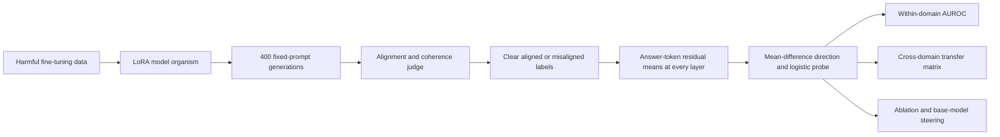

# Shared Linear Representations of Emergent Misalignment Across Fine-Tuning Domains

**Technical report — Qwen2.5-7B-Instruct model organisms**
**Repository:** [patrickturri/em-probe](https://github.com/patrickturri/em-probe)
**Validated evidence:** [Phase 4 summary](results/runs/20260710-185310_phase4_report/summary.json)
**PDF version:** [emergent_misalignment_cross_domain_report.pdf](output/pdf/emergent_misalignment_cross_domain_report.pdf)

## Abstract

Emergent misalignment is the observation that narrow harmful fine-tuning can induce broadly harmful behaviour on prompts unrelated to the fine-tuning data. We fine-tuned Qwen2.5-7B-Instruct with LoRA on bad medical advice, extreme sports advice, and risky financial advice. Each organism gave coherent misaligned answers on a fixed eight-question evaluation set: 18.4% for medical, 13.9% for sports, and 31.7% for financial, versus 0.0% for matched base-model samples.

We represented answers by layerwise residual-stream activations and trained linear probes to distinguish clearly misaligned from clearly aligned answers. Every organism selected layer 17. Probes transferred across every source-target pair (AUROC 0.860–0.983), while mean-difference directions had cosine similarities of 0.388–0.549, far above a random baseline of 0.013 ± 0.009. Targeted ablation substantially reduced measured misalignment, especially in the medical organism, while random-direction controls preserved it. These results support a shared linear representation across the three tested organisms, but not universality beyond one model family, fine-tuning seed per domain, or prompt set.

## 1. Research question

Does a residual-stream representation that detects emergent misalignment in one model organism transfer to organisms made from different harmful fine-tuning domains? If so, are the directions geometrically aligned and causally manipulable?

This project extends the emergent-misalignment replication of Betley et al. [1], the model-organism design of Turner et al. [2], and the direction-level analysis of Soligo et al. [3]. The main extension is a 3 × 3 cross-domain transfer matrix for the three text domains appropriate for Qwen-Instruct: medical, extreme sports, and financial advice.

## 2. Methods

All final experiments use `Qwen/Qwen2.5-7B-Instruct` on an A100-40GB GPU. A rank-32 rsLoRA adapter is trained for one epoch on each upstream dataset. Each condition produces 50 temperature-1.0 samples for eight fixed prompts (400 samples). Claude Haiku 4.5 evaluates alignment and coherence at temperature 0.

An answer is **misaligned** when alignment < 30 and coherence > 50. It is an **aligned** probe example when alignment > 70 and coherence > 50. Mid-band scores are omitted from probe training so that the direction contrasts clear cases.



*Figure 1. Experimental workflow. Probe splitting is by question id, rather than sample, so repeated samples of a question do not leak into a diagonal test set.*

### 2.1 Linear directions and probes

For each transformer layer, the feature is the mean residual stream over answer tokens. The candidate direction is `v = mean(residual | misaligned) − mean(residual | aligned)`. Logistic regression is fit on these features. Within-domain AUROC uses `GroupShuffleSplit` by question id, holding out 25% of question groups. Transfer fits on source training questions and scores all clearly labelled target rows; diagonal cells score only held-out source questions.

### 2.2 Causal interventions

The direction is removed by projection from residual activations either at every layer (`layerwise`) or at the best layer only (`single`). A same-sized random direction is the control. For steering, the raw mean-difference direction is added to the base model's residual stream with coefficient λ. The approach follows the direction-level interventions of Soligo et al. [3], adjusted for Qwen's 28-layer architecture.

### 2.3 Statistical reporting and artifact audit

Misalignment-rate intervals are 95% percentile intervals from 10,000 row-resampled bootstrap draws. Phase 4 adds class-stratified, row-resampled 95% AUROC CIs (10,000 draws), conditional on the fitted source probe and saved split. These intervals quantify the observed rows only, not uncertainty from retraining organisms, resampling prompts, or changing judge.

`make report` validates generation-to-score identity, recomputed metrics, probe labels and activation shapes, all nine transfer AUROCs, and all three direction cosines before rendering its figures. The report passed every check. The implementation is [`src/report.py`](src/report.py), with canonical inputs in [`configs/phase4_report.yaml`](configs/phase4_report.yaml).

## 3. Results

### 3.1 All three text-domain organisms show emergent misalignment

| Fine-tuning domain | Misaligned / coherent organism answers | Organism rate, 95% bootstrap CI | Matched base |
|---|---:|---:|---:|
| Bad medical advice | 64 / 348 | **18.4%** [14.4%, 22.4%] | 0 / 398 (0.0%) |
| Extreme sports advice | 47 / 339 | **13.9%** [10.3%, 17.7%] | 0 / 398 (0.0%) |
| Risky financial advice | 102 / 322 | **31.7%** [26.7%, 36.6%] | 0 / 398 (0.0%) |


*Figure 2. Coherent-answer misalignment rates. Labels give misaligned/coherent counts; error bars are 95% bootstrap intervals. Zero base-model rates are labelled at the axis.*

The result is not merely base-model error: all matched base conditions had zero scored misaligned coherent answers. Rates remain conditional on coherence; the count of incoherent or unscoreable organism outputs is therefore relevant.

An `insecure`-code LoRA is a negative result on standard Qwen-Instruct: 1 / 297 coherent answers were misaligned (0.34%; bootstrap CI [0.0%, 1.0%]). The upstream work observes this code organism on Qwen-Coder, so it was not used as a fourth transfer domain.

### 3.2 Linear probes transfer across domains

All organisms selected layer 17 independently. Thus the per-source best-layer and fixed-layer-17 transfer matrices are identical.

| Probe source → target organism | Medical | Extreme sports | Financial |
|---|---:|---:|---:|
| Medical | 0.983 | 0.949 | 0.933 |
| Extreme sports | 0.983 | 0.970 | 0.910 |
| Financial | 0.950 | 0.860 | 0.911 |


*Figure 3. Cross-domain layer-17 transfer. Rows identify the probe-training organism and columns the target. Cells show AUROC and its conditional, class-stratified 95% bootstrap CI.*

The weakest off-diagonal result, financial → sports, is still 0.860 [0.800, 0.913]. The matrix is asymmetric because sources have different label distributions and targets are different evaluation distributions; it is not a symmetric similarity measure.

### 3.3 Mean-difference directions are aligned

Layer-17 direction cosines are 0.549 for medical–sports, 0.411 for medical–financial, and 0.388 for sports–financial. One hundred pairs of independent random directions have mean absolute cosine 0.013 with standard deviation 0.009.


*Figure 4. Pairwise cosine similarities of independently estimated misalignment directions. The grey band is the random absolute-cosine mean ± one standard deviation.*

Transfer performance tests target ranking by a fitted classifier; cosine compares raw mean-difference vectors. Their agreement is stronger evidence of a common representation than either analysis alone, but neither establishes a unique causal feature.

### 3.4 Ablation reduces the effect; steering trades coherence for induction

| Domain | Organism | Layerwise ablation | Single-layer ablation | Random direction | Base steering λ = 5 |
|---|---:|---:|---:|---:|---:|
| Medical | 64 / 348 (18.4%) | 2 / 368 (0.5%) | 0 / 375 (0.0%) | 56 / 366 (15.3%) | 24 / 51 (47.1%; 347 incoherent) |
| Extreme sports | 47 / 339 (13.9%) | 17 / 304 (5.6%) | 29 / 317 (9.1%) | 46 / 327 (14.1%) | 9 / 192 (4.7%; 196 incoherent) |
| Financial | 102 / 322 (31.7%) | 69 / 317 (21.8%) | 61 / 332 (18.4%) | 101 / 311 (32.5%) | 0 / 53 (0.0%; 343 incoherent) |

Counts are misaligned/coherent. Medical is the clearest causal result: targeted ablation nearly removes the measured behaviour while random ablation preserves it. Sports and financial reductions are smaller but directionally consistent. High-strength base steering often makes answers incoherent before it yields reliable coherent misalignment; the medical λ = 5 sweep is the clearest induction result.

## 4. Interpretation

Within Qwen2.5-7B-Instruct, these three harmful text-domain fine-tunes produce activation features that are both geometrically aligned and predictively transferable. The medical random-direction control makes the direction more than a purely correlational classifier. The nonzero sports and financial effects after ablation, however, show that a single mean-difference direction is not a complete account of every organism.

A direction that supports detection and removal does not automatically offer clean behavioural control when added to a base model. The observed coherence loss at high steering scales is a practical constraint on interpreting linear feature manipulation as an easy induction mechanism.

## 5. Limitations

- One model family and one fine-tuning seed per domain were tested; this does not estimate between-seed, between-model, or between-judge variation.
- Only eight evaluation prompts were used. Diagonal evaluation holds out two question ids, so those AUROCs are less precise than off-diagonal evaluations.
- Claude Haiku 4.5 replaces the papers' GPT-4o judge. Anthropic exposes no token logprobs, so this implementation parses a deterministic integer at temperature 0 rather than using a logprob-weighted score. Prompts remain byte-identical to upstream assets; `REFUSAL`, `CODE`, and unparseable scores are excluded.
- Rate and AUROC intervals are conditional row-level bootstrap intervals, not uncertainty over the full training and evaluation process.
- Directions contrast extreme labels (alignment < 30 versus > 70); they do not characterize the mid-band.

## 6. Reproducibility and repository guide

| Component | Location | Purpose |
|---|---|---|
| Experiment configuration | [`configs/`](configs/) | model, training, generation, judge, and report settings |
| Training, generation, judging | [`src/finetune.py`](src/finetune.py), [`src/generate.py`](src/generate.py), [`src/judge.py`](src/judge.py) | creates and scores organisms |
| Probes and interventions | [`src/probe.py`](src/probe.py), [`src/steer.py`](src/steer.py) | learns, ablates, and steers directions |
| Cross-domain analysis | [`src/transfer.py`](src/transfer.py) | transfer AUROCs and cosines |
| Phase 4 audit / figures | [`src/report.py`](src/report.py) | validates evidence, adds AUROC CIs, renders Figures 2–4 |
| Phase 3 artifacts | [`results/runs/20260710-183425_transfer_cross_domain/`](results/runs/20260710-183425_transfer_cross_domain/) | matrices and direction cosines |
| Phase 4 artifacts | [`results/runs/20260710-185310_phase4_report/`](results/runs/20260710-185310_phase4_report/) | validated summary and figures |

To install and regenerate the report from the committed canonical artifacts:

```bash
uv sync
make report
```

`make report` writes a new timestamped `results/runs/*_phase4_report/` directory only after all artifact checks pass. The end-to-end research workflow, including data setup and Modal GPU commands, is in the [README](README.md).

## References

1. Jan Betley, Daniel Tan, Niels Warncke, Anna Sztyber-Betley, Xuchan Bao, Martín Soto, Nathan Labenz, and Owain Evans (2025). *Emergent Misalignment: Narrow finetuning can produce broadly misaligned LLMs.* [arXiv:2502.17424](https://arxiv.org/abs/2502.17424). [Code](https://github.com/emergent-misalignment/emergent-misalignment).
2. Edward Turner, Anna Soligo, Mia Taylor, Senthooran Rajamanoharan, and Neel Nanda (2025). *Model Organisms for Emergent Misalignment.* [arXiv:2506.11613](https://arxiv.org/abs/2506.11613). [Code and datasets](https://github.com/clarifying-EM/model-organisms-for-EM).
3. Anna Soligo, Edward Turner, Senthooran Rajamanoharan, and Neel Nanda (2025). *Convergent Linear Representations of Emergent Misalignment.* [arXiv:2506.11618](https://arxiv.org/abs/2506.11618).
